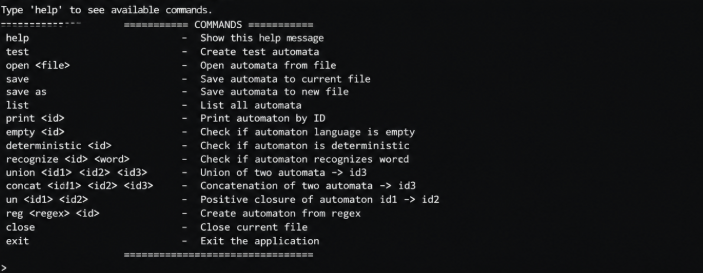
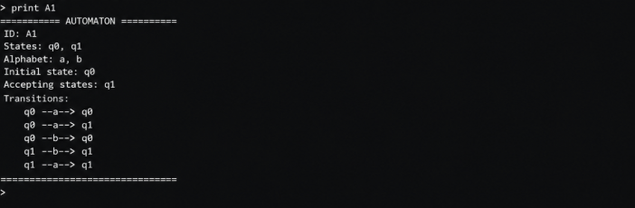

# Automata Project

Java console application for working with finite automata.

## Features

* Create automata
* Print automata
* Check if automaton is deterministic
* Check if automaton language is empty
* Recognize words
* Union of automata
* Concatenation of automata
* Positive closure
* Create automaton from regex
* Save and load automata from file

## Technologies

* Java
* Object-Oriented Programming (OOP)
* IntelliJ IDEA
* GitHub

## Project Structure

```text
Automata
 ├── Main
 ├── CommandProcessor
 │
 ├── Managers
 │    ├── AutomatonManager
 │    └── FileManager
 │
 └── Models
      ├── Automaton
      └── Transition
```

## Example Commands

```text
help
test
list
print A1
recognize A1 a
union A1 A2
concat A1 A2
save
open data.txt
```

## Screenshots

### Help Menu



### Automaton Print



## How to Run

1. Open the project in IntelliJ IDEA
2. Run `Main.java`
3. Use commands in the console

## Author
Created by: Ivaylo Markov
Course project for Object-Oriented Programming
Technical University of Varna
